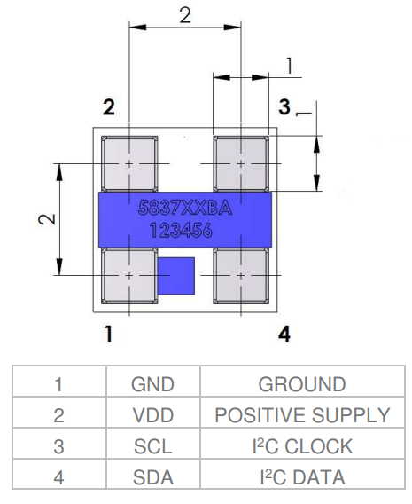
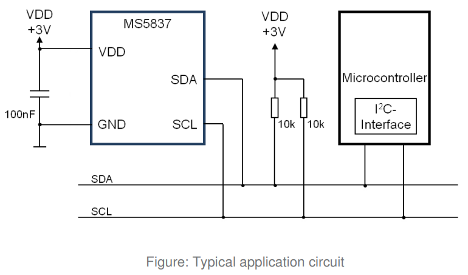

# ESPHome_MS5837
Custom ESPHome component for the MS5837-series pressure and temperature sensor.  Allows easy integration of the sensor into Home Assistant.  

# Wiring


Note: The 2 10k pull-up resistors are not typically needed on ESP32s.

# Usage
Save the source MS5837_Component.h to your Home Assistant config/esphome folder.

## Setup required libraries
Add into the "esphome" section at the top of the project yaml file.
``` yaml
esphome:
  libraries:
   - "Arduino"
   - "Wire"
   - "SPI"
  includes:
   - MS5837_Component.h
```

## Setup I2C
Tell esphome which pins to use for I2C.
``` yaml
i2c:
  sda: 21
  scl: 22
  scan: true
  id: bus_a
```

## Define the component and outputs
``` yaml
sensor:
  - platform: custom
    lambda: |-
      auto MS5837 = new MS5837_Component(60000, MS5837_MODE_ALTITUDE);
      MS5837->SetUnits(MS5837_UNITS_ALT_FT, MS5837_UNITS_PRESS_INHG, MS5837_UNITS_TEMP_F);
      App.register_component(MS5837);
      return {MS5837->temperature_sensor, MS5837->pressure_sensor, MS5837->altitude_sensor};
    sensors:
      - name: "MS5837 Temperature"
        unit_of_measurement: °F
        accuracy_decimals: 1
      - name: "MS5837 Pressure"
        unit_of_measurement: inHg
        accuracy_decimals: 3
      - name: "MS5837 Altitude"
        unit_of_measurement: ft
        accuracy_decimals: 1
```
### Create it
First instantiate the component and supply basic parameters.
``` yaml
auto MS5837 = new MS5837_Component(60000, MS5837_MODE_ALTITUDE);
```
The first parameter is the update frequency, in ms. In this case it will update every 60 seconds.
Next is the operating mode.  There are 3 choices:
- MS5837_MODE_RAW - Report only temperature and pressure
- MS5837_MODE_ALTITUDE - Report either true altitude or pressure altitude depending on if sea level pressure is supplied later
- MS5837_MODE_DEPTH - Report depth.  Needs ambient pressure for accurate results (see service "update_pressure")

### Units
Decide which units to report in (optional)
``` yaml
MS5837->SetUnits(MS5837_UNITS_ALT_FT, MS5837_UNITS_PRESS_INHG, MS5837_UNITS_TEMP_F);
```
Altitude/Depth units
- MS5837_UNITS_ALT_M  - Meters (default)
- MS5837_UNITS_ALT_FT - Feet
- MS5837_UNITS_ALT_CM - Centimeters
- MS5837_UNITS_ALT_IN - Inches

Pressure units
- MS5837_UNITS_PRESS_HPA  - HectoPascals (default)
- MS5837_UNITS_PRESS_PA   - Pascals
- MS5837_UNITS_PRESS_KPA  - KiloPascals
- MS5837_UNITS_PRESS_INHG - Inches of Mercury

Temperature units
- MS5837_UNITS_TEMP_C - Celsius (default)
- MS5837_UNITS_TEMP_F - Fahrenheit
- MS5837_UNITS_TEMP_K - Kelvin
- MS5837_UNITS_TEMP_R - Rankine

### Read the values
If using MS5837_MODE_RAW, only 2 values will be returned
``` yaml
return {MS5837->temperature_sensor, MS5837->pressure_sensor};
```
If using MS5837_MODE_ALTITUDE or MS5837_MODE_DEPTH, 3 values will be returned
``` yaml
return {MS5837->temperature_sensor, MS5837->pressure_sensor, MS5837->altitude_sensor};
```

### Home Assistant entities
Declare the entities shown in Home Assistant and name them as you prefer.  Units here are only what are displayed in Home Assistant, the actual conversion is done above.  If using MS5837_MODE_RAW, leave out the third entity (Altitude/Depth).
``` yaml
sensors:
  - name: "MS5837 Temperature"
    unit_of_measurement: °F
    accuracy_decimals: 1
  - name: "MS5837 Pressure"
    unit_of_measurement: inHg
    accuracy_decimals: 3
  - name: "MS5837 Altitude"
    unit_of_measurement: ft
    accuracy_decimals: 1
```

## Update ambient pressure from Home Assistant
The component exposes a service to Home Assistant: "_update_pressure".  It is used in either MS5837_MODE_ALTITUDE or MS5837_MODE_DEPTH.  The new pressure must be reported in hPa.

This could be done from a Home Assistant automation, such as:
``` yaml
trigger:
  - platform: state
    entity_id:
      - sensor.tempest_sensor_station_pressure
condition: []
action:
  - service: esphome.tank_level_update_pressure
    data:
      New Pressure (hPa): >-
        {{ (states('sensor.tempest_sensor_station_pressure') | float) * 33.86388640341 }} 
```
Note the conversion from the weather station's inHg to hPa.

### MS5837_MODE_ALTITUDE
Sea Level Pressure may be optionally supplied.  

- If not supplied, the altitude calculation is based on an ISA sea level pressure of 1013.25.  This results in component report pressure altitude.
- If sea level pressure is supplied, the altitude calculation is based on this pressure.  This mean the component reports true altitude.

### MS5837_MODE_DEPTH
Ambient pressure needs to be supplied to accurately calculate depth.  If not available, it assumes your location is at sea level and the depth reading will be inaccurate.  This could be supplied from another sensor above water or a weather station.  If neither are available, calculating the [standard pressure](https://www.madur.com/index.php?page=/altitude) should get you close.

# References
[MS583702BA06-50 Datasheet] (https://www.te.com/commerce/DocumentDelivery/DDEController?Action=srchrtrv&DocNm=MS5837-02BA01&DocType=DS&DocLang=English)

[MS583730BA01-50 Datasheet] (https://www.te.com/commerce/DocumentDelivery/DDEController?Action=srchrtrv&DocNm=MS5837-30BA&DocType=DS&DocLang=English)

# Thanks
Initially based on BlueRobotics' [MS5837 Arduino library](https://github.com/bluerobotics/BlueRobotics_MS5837_Library).
